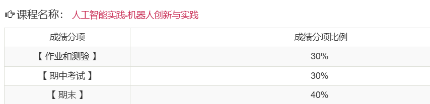

# 考核方式

## 平时成绩

- 有作业
  - 但是这个作业是学期末最后统一交的
- 有期中考试
  - 期中考试是小车巡线
- 考勤
  - 通过上课啦进行签到
  - 每节课一般下课前几分钟签到

## 期末考核

- 形式：小车巡线
  - 和期中考试相比，就是在原有的基础上增加更多要求

# 课程难度评价

## 高分难度

暂无评价

## 通过难度

如果目标是通过考核，课程难度还是具有一定难度的。

主要是每一次的小车都会有一些变化，如重量，组件等，而你的代码也需要不断调试以适应这种改变。

## 学习建议

- 无

# 历届学生反馈

> 以下内容来自学生贡献，保留原始观点。

## 2024届

- 贡献者：匿名
- 评价：
- 总结：
