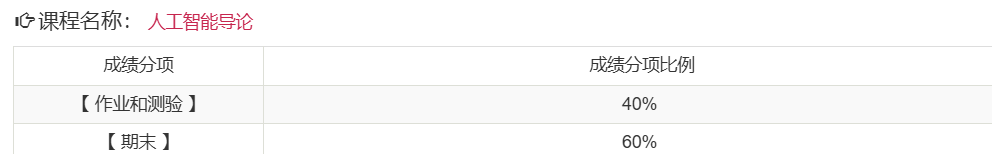

# 考核方式

## 平时成绩

- 无平时作业(**存疑，不过大概率是没有的**)
- 有期中大作业
- 考勤
  - 通过上课啦进行签到
  - 每节课一般上课后几分钟内签到
- 根据记忆，应该是期中大作业占40%，期末大作业占60%

## 期末考核

- 形式：大作业
- 具体要求：见[期末大作业要求](../../exams/期末大作业题目与要求/期末课程论文要求.doc)

# 课程难度评价

## 高分难度

高分相对简单

## 通过难度

如果目标是通过考核，课程难度较低。

## 学习建议

- 无

# 历届学生反馈

> 以下内容来自学生贡献，保留原始观点。

## 2024届

- 贡献者：匿名
- 评价：课程难度并不高，不过对于信智学院的学生，大作业会相对复杂一些，但问题不是很大，想要拿高分还是比较容易的
- 总结：课程难度较低，对信智学生有额外要求
