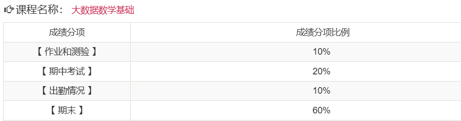

# 考核方式

## 平时成绩

- 有平时作业
- 有期中考试
- 考勤
  - 通过上课啦进行签到
  - 每节课一般上课后几分钟内签到

## 期末考核

- 形式：闭卷考试
- 具体要求：见[复习手册](../../exams/大数据数学基础_期末复习手册.docx)

# 课程难度评价

## 高分难度

暂无评价

## 通过难度

如果目标是通过考核，课程难度仍具有一定难度。

## 学习建议

- 做一下平时的练习题和真题，再按照考查范围和不熟悉知识点进行针对性复习

# 历届学生反馈

> 以下内容来自学生贡献，保留原始观点。

## 2024届

- 贡献者：匿名
- 评价：zc老师最后几节课会划一下重点，讲一下考试范围和题型
- 总结：考前会划重点
