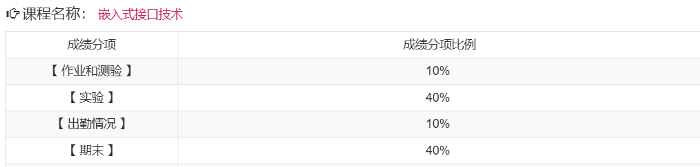

# 考核方式

## 平时成绩

- 有平时作业
  - 理论作业 + 实验报告
- 无期中考试
- 考勤
  - 通过上课啦进行签到
  - 每节课一般下课前几分钟签到

## 期末考核

- 形式：闭卷考
- 具体要求：见[期末复习及成绩组成](../../exams/期末考试复习要点及综评成绩组成.docx)
  - **注意从26届开始，期末考斩杀线提高到了50分，即你期末成绩低于50则直接挂科**

# 课程难度评价

## 高分难度

暂无评价

## 通过难度

如果目标是通过考核，课程难度中等。

## 学习建议

- 无

# 历届学生反馈

> 以下内容来自学生贡献，保留原始观点。

## 2024届

- 贡献者：匿名
- 评价：
  - 平时作业和实验都交，不要缺勤太多次，一般都可以通过。但是期末还是得复习一下，期末考试还是具有一定难度的。
  - zhq老师能看出来还是具有一定的教学理想的，如果对硬件感兴趣的同学可以考虑上他开的《智能物联网实践》。
- 总结：平时成绩需要注重，期末考具有一定难度
