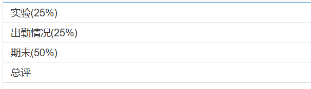
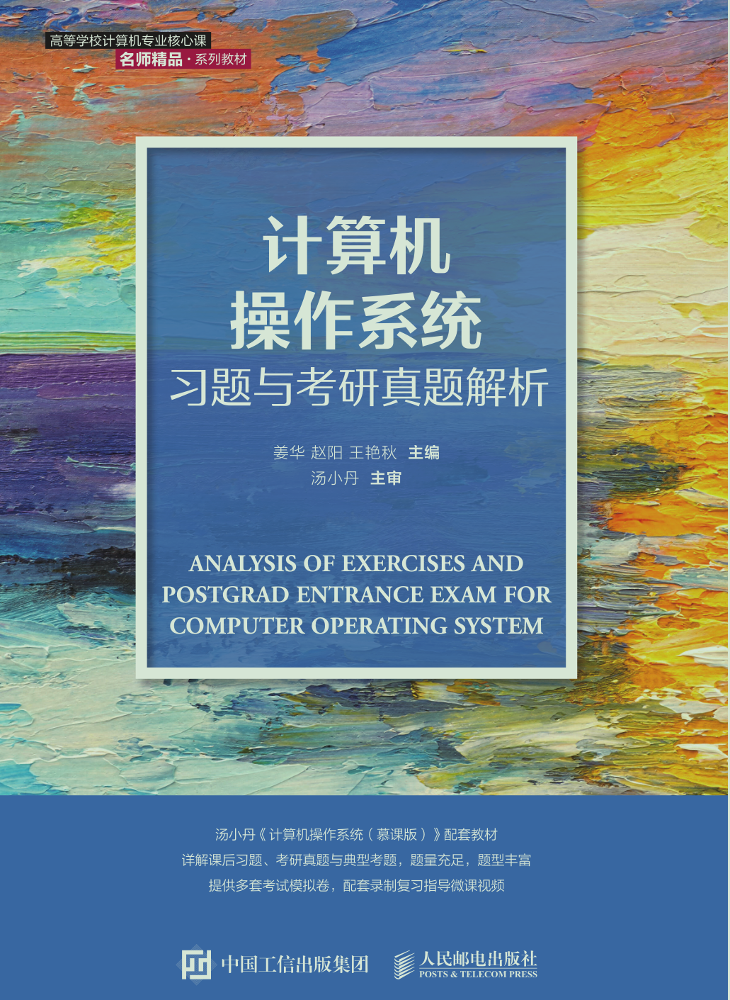

# 考核方式

## 平时成绩

- 不记得是否有平时作业和期中考试了
- 考勤
  - 通过上课啦进行签到
  - 一般临近下课进行签到

## 期末考核

- 形式：上机考
- 题目完全来自于：
- [2026考试重点](https://kv6qy98aabe.feishu.cn/wiki/HEhvwNjGOi5IwJk2djOcLrzMnqd?from=from_copylink)
  - 这是我之前复习时根据yxf老师给出的重点整理的习题
  - 文档中的所有题目都来自于上面提到的那本习题集，只是答案做了简化

# 课程难度评价

## 高分难度

期末高分相对容易，只要你把老师给出的重点自己做一遍基本就够了

## 通过难度

如果目标是通过考核，课程难度较低。

## 学习建议

- 期末考题目难度并不高，照老师画出的重点复习即可（还是需要做一下习题）
- 对操作系统比较感兴趣，可以看看[jyy老师的课](https://jyywiki.cn/)
  - 但是难度还是挺大的，在ai的帮助下也是云里雾里，我个人感觉许多前置知识的缺乏是一个重要原因

# 历届学生反馈

> 以下内容来自学生贡献，保留原始观点。

## 2026届

- 贡献者：匿名
- 评价：yxf老师给分还是比较大方的，期末考试难度不高
- 总结：
