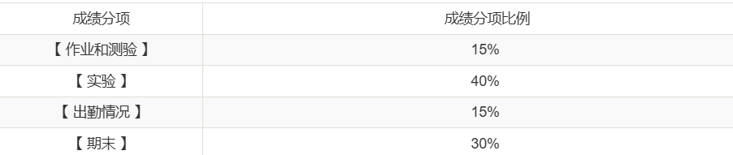

# 考核方式

## 平时成绩

- 有平时作业
- 每次课基本都有实验，需要分组
  - 每次下课后要提交小组报告（**存疑**）
- 有期中考试（（**存疑，印象中应该是有一个期中测验的**）
- 考勤
  - 通过上课啦进行签到
  - 每节课一般上课后签到
    - 上课后几分钟到几十分钟不等
  - 以两课时为一节课，每节课上课后都会签到

## 期末考核

- 形式：闭卷考试
- 复习资料可以参考：[练习题](../exams/普通物理练习题第8版%20%20.doc)

# 课程难度评价

## 高分难度

由于zhy老师平时分打得比较高，因而高分的难度是较低的。

只要认真备考，一般而言都能拿到较高分数。

## 通过难度

如果目标是通过考核，课程难度较低。
期末只要及格,一般都能过。

## 学习建议

- 无

# 历届学生反馈

> 以下内容来自学生贡献，保留原始观点。

## 2026届

- 贡献者：匿名
- 评价：zhy老师平时分给得很高，对于想要冲高分的同学可以考虑一下。
- 总结：平时分给分较高
