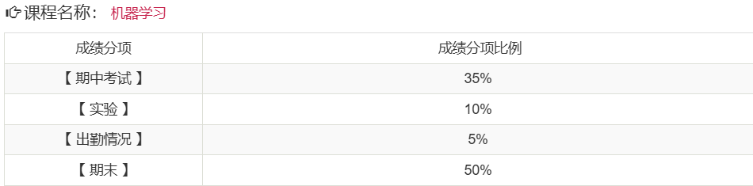

# 考核方式

## 平时成绩

- 有平时作业
- 有期中大作业，论文形式
- 考勤
  - 通过上课啦进行签到
  - 签到次数较少，基本都是在第二节课签到
    - 一节课为两个课时

## 期末考核

- 形式：闭卷考
- 考纲：见[电子化考纲](../../exams/考纲/电子化考纲.md)
- **注意：其他老师期末考核是大作业的形式**

# 课程难度评价

## 高分难度

暂无评价

## 通过难度

如果目标是通过考核，课程难度一般。

## 学习建议

- 无

# 历届学生反馈

> 以下内容来自学生贡献，保留原始观点。

## 2024届

- 贡献者：匿名
- 评价：why老师给分还算大方，只要认真复习，不太会挂科，但是高分可能需要在平时多花心思。
- 总结：通过难度较低，高分有一定难度
