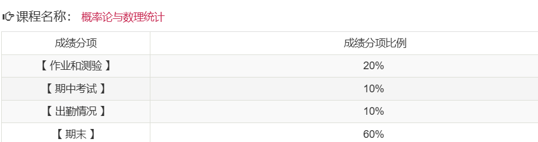

# 考核方式

## 平时成绩

- 有平时作业
- 有期中考试
- 考勤
  - 通过上课啦进行签到
  - 每节课一般下课前几分钟签到

## 期末考核

- 形式：闭卷考

# 课程难度评价

## 高分难度

暂无评价

## 通过难度

如果目标是通过考核，课程仍具有一定难度。

## 学习建议

- 无

# 历届学生反馈

> 以下内容来自学生贡献，保留原始观点。

## 2024届

- 贡献者：匿名
- 评价：期末考试可能和期中考试的题有一定相似性
- 总结：
