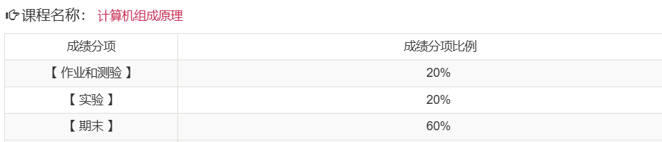

# 考核方式

## 平时成绩

- 有平时作业
- 无期中考试
- 考勤
  - 通过上课啦进行签到
  - 基本不签到

## 期末考核

- 形式：有两次考试
  - 实验考核：
    - 在计算机组成原理实验仪上进行
    - 流水灯，“1+2+3+…+100”
  - 闭卷考：

# 课程难度评价

## 高分难度

暂无评价

## 通过难度

如果目标是通过考核，课程难度具有一定难度。

## 学习建议

- 无

# 历届学生反馈

> 以下内容来自学生贡献，保留原始观点。

## 2024届

- 贡献者：匿名
- 评价：18年的真题都没怎么考，主要还是教材上的练习题
- 总结：注重教材原题
