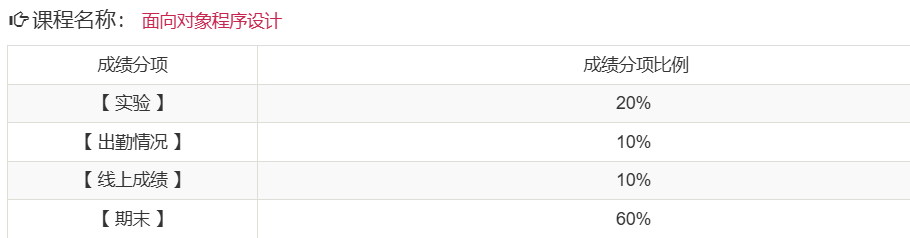

# 考核方式

## 平时成绩

- 有平时作业
- 无期中考试
- 考勤
  - 通过上课啦进行签到
  - 每节课一般下课前几分钟签到

## 期末考核

- 形式：闭卷考

# 课程难度评价

## 高分难度

该课程想要拿高分，其难度并没有很高。

- 实验只要每次都交就能拿满
- 线上成绩
  - 忘记线上成绩是哪里来的了
  - 有的老师考察方式不同，是没有这个线上成绩的
- 期末考试
  - 期末考难度不是很高，多看看真题即可

## 通过难度

如果目标是通过考核，课程难度较低。

## 学习建议

- 无

# 历届学生反馈

> 以下内容来自学生贡献，保留原始观点。

## 2024届

- 贡献者：匿名
- 评价：
- 总结：
